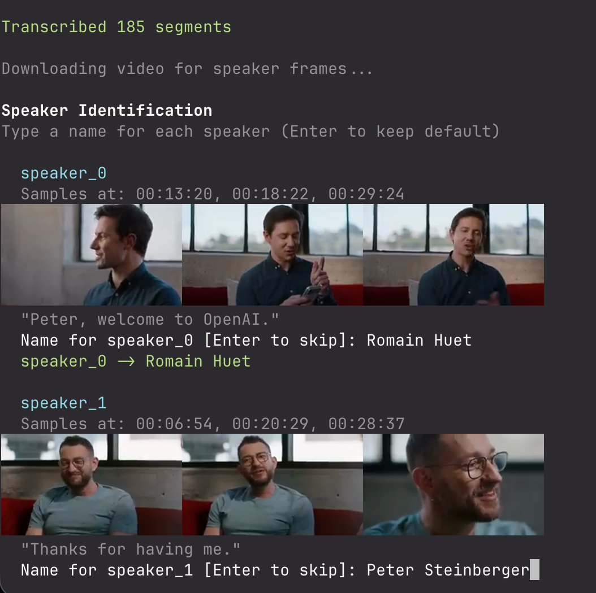

# yt-transcribe

Transcribe YouTube videos from the command line with high-quality timestamps, optional speaker diarization, and Obsidian-friendly Markdown output.



## Features

- Downloads source audio from a YouTube URL using `yt-dlp`
- Transcribes with either:
  - `faster-whisper` (local)
  - `ElevenLabs` Speech-to-Text (API)
- Optional speaker diarization
  - Local diarization with `pyannote.audio`
  - Native diarization via ElevenLabs
- Optional interactive speaker naming flow with frame previews
- Supports clipping with `--start` / `--end`
- Writes both structured JSON and clean Markdown transcript output

## Requirements

- Python 3.10+ (3.12 tested)
- `ffmpeg` on your `PATH`
- Provider dependencies:
  - Local transcription: `yt-dlp`, `faster-whisper`
  - ElevenLabs transcription: `yt-dlp`, `elevenlabs`
  - Local diarization: `torch`, `pyannote.audio` (+ Hugging Face token)

Install `ffmpeg` on macOS:

```bash
brew install ffmpeg
```

## Install

```bash
git clone https://github.com/<your-username>/yt-transcribe.git
cd yt-transcribe

python3 -m venv .venv
source .venv/bin/activate
python -m pip install --upgrade pip

# Core + local transcription
pip install yt-dlp faster-whisper

# Optional provider
pip install elevenlabs

# Optional local diarization
pip install torch pyannote.audio
```

## Usage

```bash
./yt-transcribe "<youtube-url>"
```

Common examples:

```bash
# Save in current directory (skip Obsidian vault output)
./yt-transcribe "<youtube-url>" --no-vault

# Use ElevenLabs provider
./yt-transcribe "<youtube-url>" --provider elevenlabs --elevenlabs-api-key "$ELEVENLABS_API_KEY"

# Clip only a section of the video
./yt-transcribe "<youtube-url>" --start 01:20 --end 03:45 --no-vault

# Local diarization with a known speaker count
./yt-transcribe "<youtube-url>" --diarize --speakers 2 --hf-token "$HF_TOKEN"

# Interactive speaker naming (implies --diarize)
./yt-transcribe "<youtube-url>" --name-speakers --hf-token "$HF_TOKEN"
```

Full options:

```bash
./yt-transcribe --help
```

## Environment Variables

- `HF_TOKEN`: required for local diarization with `pyannote.audio`
- `ELEVENLABS_API_KEY`: required when `--provider elevenlabs`

## Output

For each transcription run, the tool writes:

- `<video-title>.json`: machine-readable transcript, timestamps, metadata
- `<video-title>.md`: Obsidian-compatible Markdown transcript
- `<video-title>.elevenlabs.raw.json`: raw ElevenLabs payload (only for ElevenLabs runs)

By default output goes to:

`~/obsidian/vault/Transcripts`

Override with:

- `--no-vault` to write to current directory
- `--output <dir>` to write to a specific directory

## Example ElevenLabs Output

Real example output files are included in [`examples/elevenlabs`](./examples/elevenlabs):

- [Markdown transcript](./examples/elevenlabs/openclaw-builders-unscripted.md)
- [Normalized JSON transcript](./examples/elevenlabs/openclaw-builders-unscripted.json)
- [Raw ElevenLabs response JSON](./examples/elevenlabs/openclaw-builders-unscripted.elevenlabs.raw.json)

## Notes

- This script currently requests YouTube cookies from local Chrome via `yt-dlp` (`cookiesfrombrowser`).
- Speaker preview fallback uses `open` on macOS when inline terminal image rendering is unavailable.

## License

MIT. See [LICENSE](./LICENSE).
